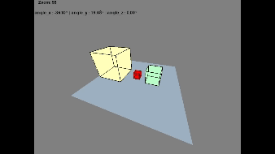
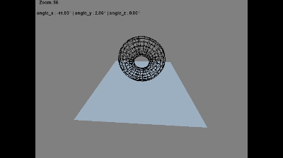
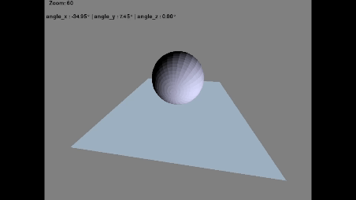
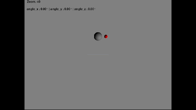

# 3D Graphics engine

## Overview
This project builds on the PyGame package's window creation and 2D shape display capabilities to create a 3D graphics engine. To do so, several transformations were written to allow for rotations around axes and to perform 3D to 2D coordinate calculations. The program is fully capable of displaying 3D objects such as cubes, cylinders and spheres. Later iterations added physics attributes to classes such as `Sphere` that allow for bouncing animations.

## Features
- Rotates vertices around axes using `rotation_matrix()`
- Projects 3D coordinates to 2D `project_3d_to_2d()`
- Uses `pygame.draw()` functions to draw projected vertices
- Shadow implementations in the `Sphere` class
- Physics implementations in the `Sphere` class
- Zoom with scroll wheel
- Rotate using left-click
- Press `i` key for isometric view
- Press `r` key for front view

### Cube Display

### Torus Display

### Sphere shaders

### Physics Implementations

## Requirements
- **Python** - 3.x
- **Install PyGame**
'''bash
pip install pygame
'''
